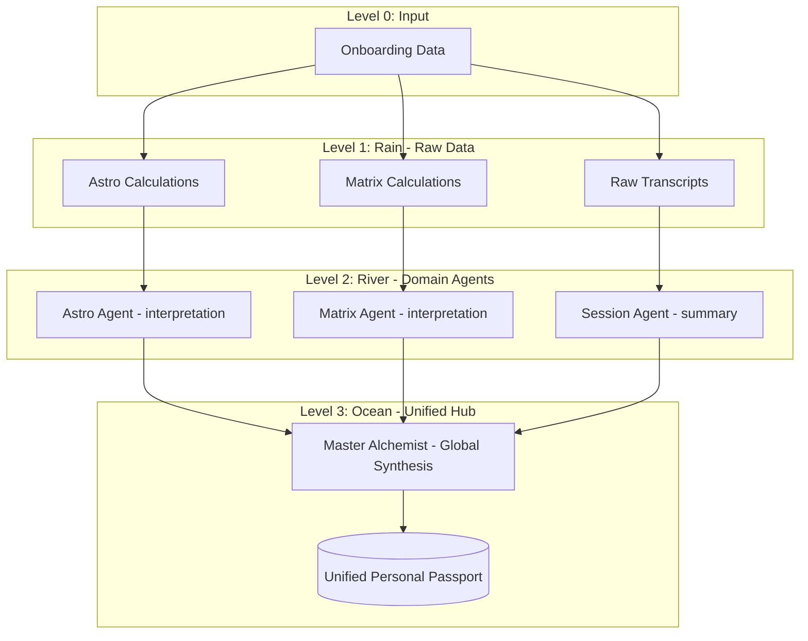

# Архитектура Rain-River-Ocean v2: Масштабируемая Система Синтеза

Согласно актуализированным требованиям Старшего Архитектора, система пересмотрена в пользу четкого разделения уровней ответственности и подготовки к масштабированию на несколько систем знаний (Астрология, Матрица Судьбы и др.).

---

## 0. Уровень Ввода (Level 0: Input)
*   **Задача**: Получение первичных параметров от пользователя (дата, время, место рождения, пол, имя).
*   **Результат**: Базовый профиль пользователя в БД.

---

## 1. Уровень Rain (Дождь: Сырые данные)
*   **Задача**: Выполнение "сухих" математических или технических расчетов.
*   **Принципы**: Никакой интерпретации. Только числа, координаты, строгие факты. Каждый домен (учение) имеет свой Rain-сервис.
*   **Примеры**:
    *   **Astro-Rain**: Расчет градусов планет, домов, аспектов (натальная карта).
    *   **Matrix-Rain**: Расчет кодов и энергий по дате рождения (Матрица Судьбы).
    *   **User-Rain**: Сырые транскрипты сообщений без обработки.

---

## 2. Уровень River (Река: Доменная интерпретация)
*   **Задача**: Тематическая интерпретация данных из уровня Rain с помощью специализированных LLM-агентов.
*   **Принципы**: Каждый River-сервис жестко привязан к одному учению. Агент этого уровня является "специалистом" в конкретной области.
*   **Примеры**:
    *   **Astro-River**: LLM-агент (Астролог), который превращает натальную карту (Rain) в психологическое описание 12 сфер.
    *   **Matrix-River**: LLM-агент (Нумеролог), который описывает предназначение и кармические задачи на основе расчетов Матрицы.
    *   **Session-River**: LLM-агент (Психолог), который структурирует текущее состояние и "вайб" пользователя из сырых сообщений.

---

## 3. Уровень Ocean (Океан: Единый Хаб / Аватар)
*   **Задача**: Глобальный синтез интерпретаций из всех доступных Рек (Rivers).
*   **Принципы**: Это "Верховный Алхимик", который не лезет в расчеты, а собирает готовые смыслы. Он объединяет их в единую структуру — **Единый Паспорт Личности (User Print)**.
*   **Структура Хаба**: Имеет предустановленные "слоты" под различные системы знаний, что позволяет легко подключать новые Rivers.

---

## Преимущества Масштабируемости
Для добавления новой системы (например, Дизайн Человека):
1.  Создается **L1-Service (HD-Rain)** для расчетов бодиграфа.
2.  Создается **L2-Service (HD-River)** с агентом-аналитиком HD.
3.  L3 (Ocean) просто получает новый поток данных и интегрирует его в Паспорт, не меняя свою логику.

