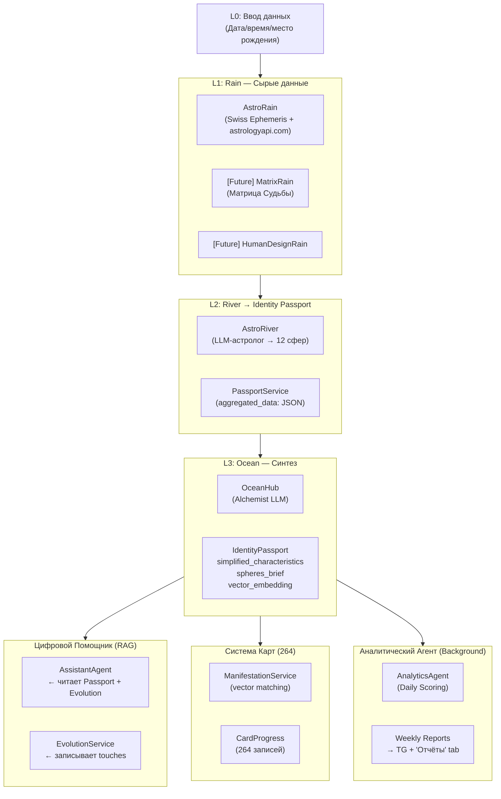

# AVATAR — Архитектура Системы v3.0

> Последнее обновление: Март 2026 | Статус: PRODUCTION

## Философия

AVATAR — Платформа Эволюции Сознания, синтезирующая астрологию, психологию и ИИ для создания персонального цифрового двойника, который эволюционирует вместе с человеком.

**Ключевые принципы:**
- **Данные отделены от логики** — уровни Rain/River/Ocean/Evolution — это контекст, а не императив
- **AI-First** — все взаимодействия персонализированы через паспорт личности
- **Бессменный Паспорт** — единый источник правды по каждому пользователю
- **Безопасность** — без медицинских диагнозов, полная анонимность

---

## 4-Уровневая Архитектура Данных



---

## L0 — Ввод данных

**Файлы:** `routers/calc.py`, `routers/auth.py`

Пользователь проходит онбординг: вводит дату, время и место рождения. Данные сохраняются в модель `User` и немедленно запускают биопроцессинг через фоновую задачу.

| Поле | Тип | Описание |
|------|-----|----------|
| `birth_date` | Date | Дата рождения |
| `birth_time` | Time | Время рождения |
| `birth_place` | String | Место рождения |
| `birth_lat/lon/tz` | Float/String | Геокоординаты и часовой пояс |

---

## L1 — Rain (Сырые расчёты)

**Файлы:** `rro/astro/rain.py`, `rro/astro/api_client.py`

Математические расчёты без интерпретации:
- **Swiss Ephemeris** — градусы планет, домов, аспектов
- **astrologyapi.com** (ID: `651052`) — обогащение расшифровками
- Результат сохраняется в `NatalChart.planets_json` и `NatalChart.aspects_json`

> **Масштабируемость**: Для добавления новой системы (Матрица Судьбы, Human Design) — создаётся новый Rain-сервис, River и канал в Passport.

---

## L2 — River → Identity Passport

**Файлы:** `rro/astro/river.py`, `rro/passport_service.py`

`AstroRiver` берёт данные из `NatalChart` и через параллельный LLM-синтез создаёт психологические интерпретации всех 12 сфер.

Результат записывается через `PassportService.update_channel_data()` в `IdentityPassport.aggregated_data`:

```json
{
  "astrology": {
    "source": "astrologyapi",
    "data": {
      "spheres": {
        "IDENTITY": {"shadow": "...", "light": "...", "insight": "..."},
        "RESOURCES": {...},
        ...12 сфер
      }
    }
  }
}
```

---

## L3 — Ocean (Синтез / Алхимик)

**Файлы:** `rro/ocean/hub.py`

`OceanService.update_ocean()` — финальный шаг конвейера:
1. Читает `IdentityPassport.aggregated_data`
2. LLM-синтез: создаёт `simplified_characteristics` (5-7 черт) и `spheres_brief` (12 кратких резюме)
3. Записывает в `IdentityPassport`
4. Запускает Vector Matching → Manifestation карт
5. Авто-векторизует паспорт (`PassportService.vectorize_passport()`)

---

## Evolution Layer (L4)

**Файлы:** `services/evolution_service.py`, `models/user_evolution.py`

Хронология всех взаимодействий пользователя с системой:

| Метод | Когда вызывается |
|-------|-----------------|
| `record_touch()` | После каждого сообщения помощнику |
| `record_nn_interaction()` | После генерации ответа агента |
| `update_session_progress()` | После завершения Sync/Align сессии |
| `vectorize_if_needed()` | Авто: после 10 обновлений |

---

## Техническая структура

```
backend/app/
├── agents/
│   ├── assistant_agent.py    # Цифровой помощник (RAG)
│   ├── analytics_agent.py    # Аналитик (фоновый)
│   ├── analytic_agent.py     # Анализ сессий зеркала
│   └── sync_agent.py         # Агент синхронизации
├── core/
│   ├── astrology/
│   │   ├── natal_chart.py    # Swiss Ephemeris
│   │   ├── llm_engine.py     # L2 синтез сфер
│   │   ├── vector_matcher.py # RAG: архетип ↔ текст
│   │   └── priority_engine.py
│   ├── economy.py            # Энергия, XP, ранги
│   └── manifest_service.py   # Проявление карт
├── models/                   # 15 SQLAlchemy моделей
├── routers/                  # 15 FastAPI роутеров
├── rro/                      # Rain-River-Ocean конвейер
│   ├── astro/                # Астро-ветвь
│   ├── ocean/                # L3 синтез
│   ├── session/              # Session-River
│   └── passport_service.py   # Менеджер Identity Passport
└── services/
    ├── evolution_service.py  # Трекер эволюции
    └── notification.py       # TG уведомления
```
